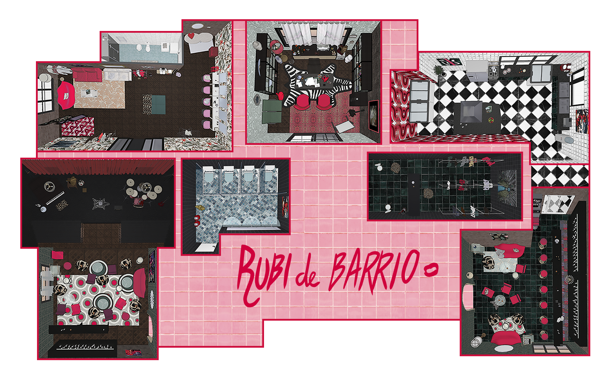
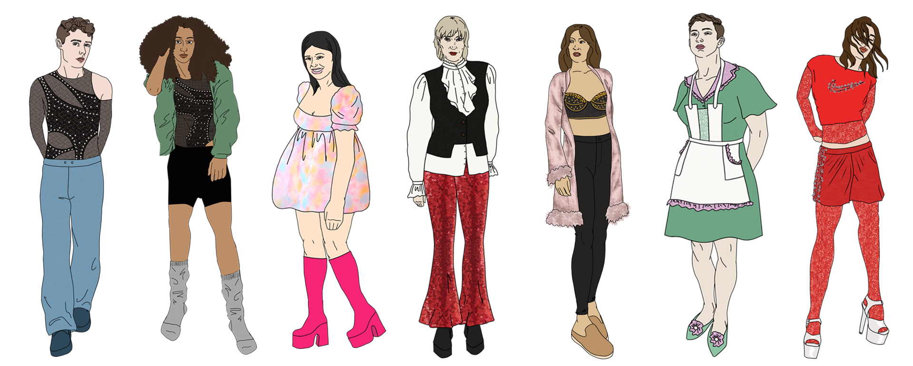

<body>
    

    
    <!-- ################################################################## -->
    <h1>El bodegón más vistoso en bucle</h1>
    

        
        
creado por Paula Mañero & Paula Sanz

    

    

        
    

    

        

            <input class="rubi_input" type="password" id="password" placeholder="Enter password">
            <button class="rubi_btn" onclick="checkPassword()">Submit</button>
        

        
 
            <iframe
                max-width="560" height="315" frameborder="0" allowfullscreen
                iv_load_policy="3"
                src="https://www.youtube.com/embed/ngMNZAJsP0c?modestbranding=1&rel=0&controls=0"
                origin="RubideBarrio" widget_referrer="RubideBarrio"></iframe>
        

    

    
        
    
    

    <!-- ################################################################## -->
    <h1>DESCRIPCIÓN</h1>
    
resumen del proyecto

    <!-- ################################################################## -->
    <h1>SINOPSIS</h1>
    
bla

    

        
    

    

    <!-- ################################################################## -->
    <h1>¿QUIENES SOMOS?</h1>
    
Texto de presentación

    
    

    <!-- ################################################################## -->
    <h1>FOTOS RODAJE</h1>

    

    

        

            
        

        

            
        

        

            
        

        

            
        

        

            
        

        

            
        

    

    
</body>

