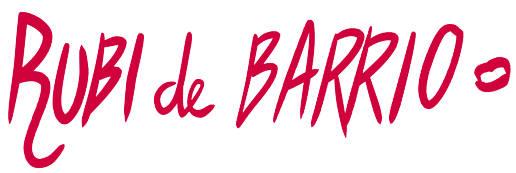
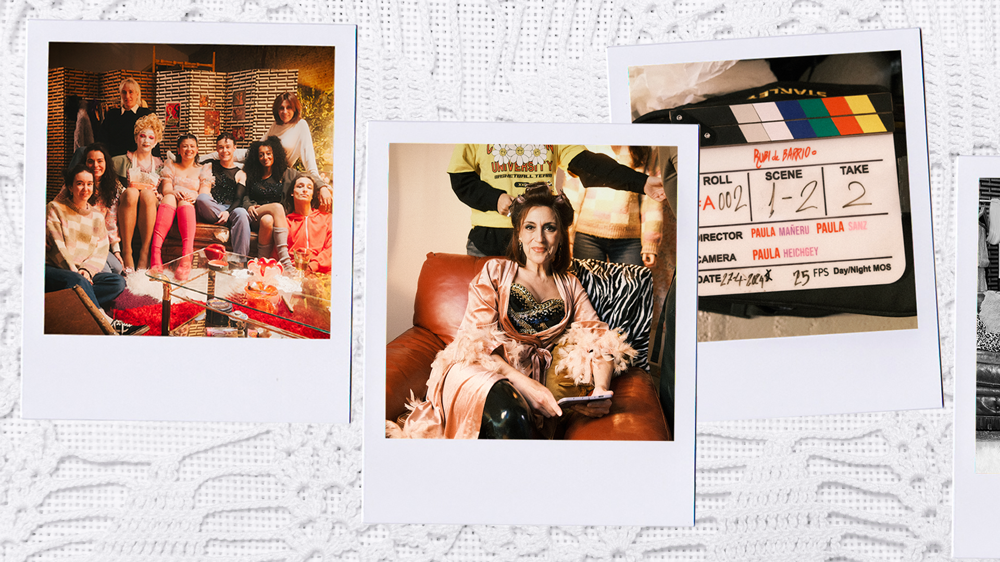
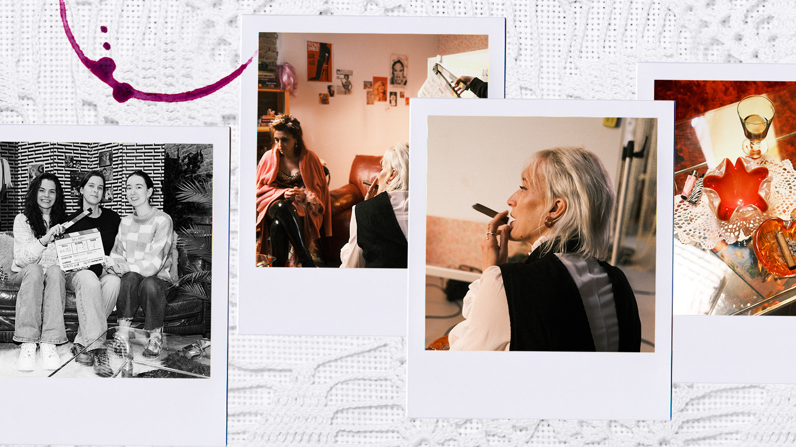
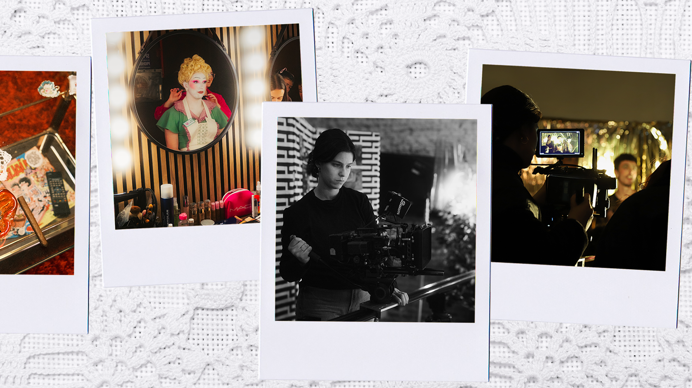
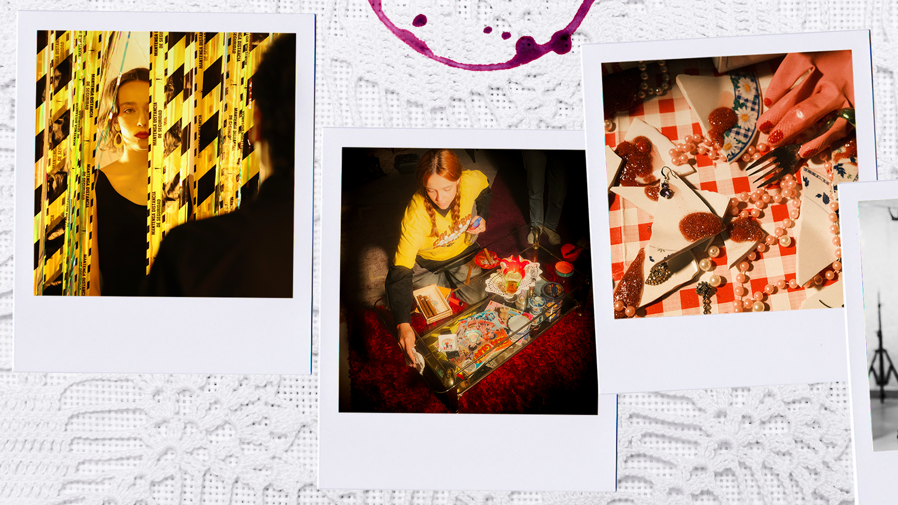
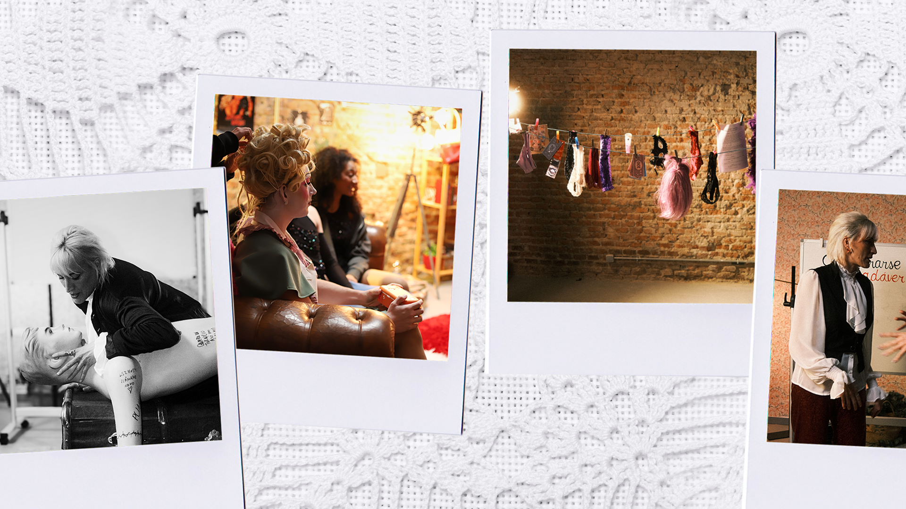

<body>
    <header>
        
        <nav>
            
            
            

                <a href="/teaser">Teaser</a>
            

        </nav>
    </header>

    <!-- ################################################################## -->
    <section class="hero">
        

            
        

        

        <!-- 

            <h1>Rubí de Barrio</h1>
            
Una serie de género comedia/misterio creada por Paula Mañeru y Paula Sanz.

        
 -->
    </section>

    <section>
        
    </section>

    <!-- ################################################################## -->
    <section>
        <h1>Descripción</h1>
        

            Rubí de Barrio es una serie de género comedia/misterio creada por Paula Mañeru y Paula Sanz. Inspirada en
            una obra teatral producida en nuestra adolescencia, el proyecto comenzó tanto como un desafío para nosotras
            mismas, como una carta de amor a nuestros amigos que también participaron en aquella obra de teatro. La
            pregunta “¿Qué querríamos contar ahora?” nos llevó a desarrollar el mundo en el que el Cabaret existía y el
            tipo de aventuras que disfrutaríamos viendo a los personajes vivir.

            A pesar de ser una serie de entretenimiento, Rubí de Barrio refleja realidades y conversaciones presentes
            entre la gente de nuestra generación que a menudo no se ven representadas en los medios.

        

    </section>

    <!-- ################################################################## -->
    <section>

        <h1>Sinopsis</h1>
        
Sepultadas bajo montañas de facturas por pagar, Verónica, Sofía y su séquito de mamarrachas del (ahora)
            decadente Cabaret Rubí arriesgan sus vidas al encontrarse un cliente muerto en el club. Con la policía
            en los talones y un cadáver en la nevera, Verónica hace todo lo posible por salvar su local de la ruina
            y de las torpes estrategias de sus compañeros. El espectáculo debe continuar, ¿no?

        

            
        

    </section>

    <!-- ################################################################## -->
    <section>
        <h1>Personajes</h1>

        

            

                <h4>Veronica</h4>
                

                    La dueña del cabaret. Trata de mantener el recuerdo de su madre, el icono
                    del cabaret Renata Rubí, vivo a través del local, lo cual le llevará a tomar decisiones cada vez más
                    controvertidas para salvarlo.
                

            

            

                <h4>Sofía</h4>
                

                    La otra cara de la moneda de Verónica. Alcohólica funcional siempre trata de
                    evadirse y entretenerse. Más pesimista frente a la realidad, sólo está dispuesta a luchar por Verónica y
                    se verá obligada a hacerlo.
                

            

            

                <h4>El elenco</h4>
                

                    Compuesto por un grupo de jóvenes eclécticos, el resto de los artistas del
                    cabaret está dividido entre personajes realistas y otros más fantasiosos que dan lugar a divertidos
                    intentos de ayudar.
                

            

        

    </section>

    <!-- ################################################################## -->
    <section>

        <h1>¿Quienes somos?</h1>
        

            ¡Hola! Soy Paula (Mañeru). Nací en el 97, así que llevo 27 años aferrándome a todo estímulo creativo y
            enganchada a la purpurina. Empecé a hacer teatro desde pequeña (ahí me encontré a Paula) y, cuando crecí,
            volé a Madrid para formarme como actriz y compaginarlo con la carrera de Comunicación Audiovisual en la
            UC3M.
            Siempre he tenido inquietud por sacar adelante proyectos propios desde las obras del grupo de teatro a
            pequeños
            cortometrajes. Recientemente, he trabajado para el equipo de Dirección de Cuéntame Cómo Pasó (T22, T23) y
            Sueños de Libertad.
        

        

            Yo soy Paula (Sanz). Desde pequeña soñaba con habitar mundos de fantasía y eso me llevó a creer que quería
            ser actriz, así que hice teatro hasta que me di cuenta de que prefería crear esos mundos. Tras estudiar
            Relaciones Internacionales, decidí viajar a Inglaterra para estudiar Comunicación y Producción Audiovisual,
            un país en el que sigo residiendo y trabajando en el ámbito de la producción. Sueños por alcanzar ya solo me
            quedan rodar nuestra serie y conocer a una jirafa.
        

    </section>

    <!-- ################################################################## -->
    <h1>Fotos rodaje</h1>

    

    <section class="slideshow-container">
        

            
            
            
            <!-- 
            
             -->
        

    </section>

    

</body>