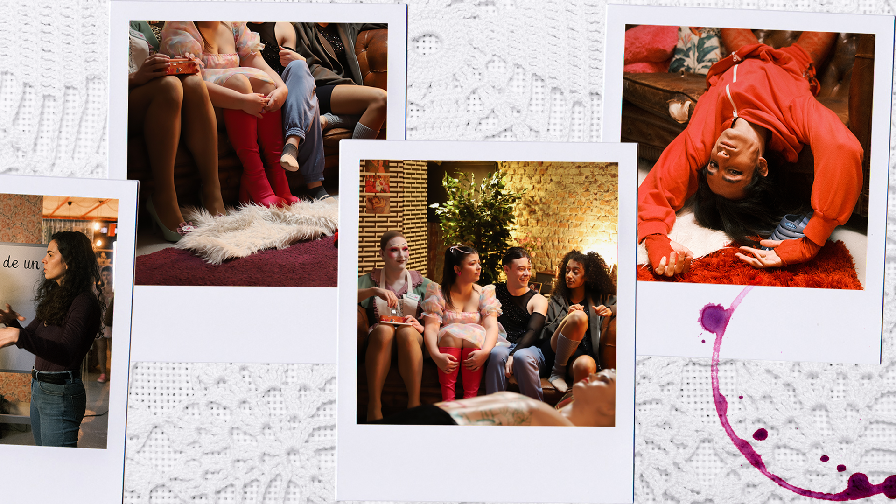

<body>
    <!-- ################################################################## -->
    <section id="test"
        style="margin: 0; background-color: black; height: 100vh; display: flex; justify-content: center; align-items: center;">
        
        <!--  -->

        <!-- 

            Rubí de Barrio es una serie de género comedia/misterio
            creada por Paula Mañeru y Paula Sanz.
        
 -->

    </section>

    

        
    

    <!-- ################################################################## -->
    <section>
        <h1>DESCRIPCIÓN</h1>
        

            Rubí de Barrio es una serie de género comedia/misterio creada por Paula Mañeru y Paula Sanz. Inspirada en
            una obra teatral producida en nuestra adolescencia, el proyecto comenzó tanto como un desafío para nosotras
            mismas, como una carta de amor a nuestros amigos que también participaron en aquella obra de teatro. La
            pregunta “¿Qué querríamos contar ahora?” nos llevó a desarrollar el mundo en el que el Cabaret existía y el
            tipo de aventuras que disfrutaríamos viendo a los personajes vivir.

            A pesar de ser una serie de entretenimiento, Rubí de Barrio refleja realidades y conversaciones presentes
            entre la gente de nuestra generación que a menudo no se ven representadas en los medios.

        

    </section>

    <!-- ################################################################## -->
    <section>

        <h1>SINOPSIS</h1>
        
Sepultadas bajo montañas de facturas por pagar, Verónica, Sofía y su séquito de mamarrachas del (ahora)
            decadente Cabaret Rubí arriesgan sus vidas al encontrarse un cliente muerto en el club. Con la policía
            en los talones y un cadáver en la nevera, Verónica hace todo lo posible por salvar su local de la ruina
            y de las torpes estrategias de sus compañeros. El espectáculo debe continuar, ¿no?

        

            
        

    </section>

    <!-- ################################################################## -->
    <section>
        <h1>PERSONAJES</h1>

        <ul>
            <li><strong>Veronica</strong> - La dueña del cabaret. Trata de mantener el recuerdo de su madre, el icono
                del cabaret Renata Rubí, vivo a través del local, lo cual le llevará a tomar decisiones cada vez más
                controvertidas para salvarlo.</li>
            <li><strong>Sofía</strong> - La otra cara de la moneda de Verónica. Alcohólica funcional siempre trata de
                evadirse y entretenerse. Más pesimista frente a la realidad, sólo está dispuesta a luchar por Verónica y
                se verá obligada a hacerlo.</li>
            <li><strong>El elenco</strong> - Compuesto por un grupo de jóvenes eclécticos, el resto de los artistas del
                cabaret está dividido entre personajes realistas y otros más fantasiosos que dan lugar a divertidos
                intentos de ayudar.</li>
        </ul>
    </section>

    <!-- ################################################################## -->
    <section>

        <h1>¿QUIENES SOMOS?</h1>
        

            ¡Hola! Soy Paula (Mañeru). Nací en el 97, así que llevo 27 años aferrándome a todo estímulo creativo y
            enganchada a la purpurina. Empecé a hacer teatro desde pequeña (ahí me encontré a Paula) y, cuando crecí,
            volé a Madrid para formarme como actriz y compaginarlo con la carrera de Comunicación Audiovisual en la
            UC3M.
            Siempre he tenido inquietud por sacar adelante proyectos propios desde las obras del grupo de teatro a
            pequeños
            cortometrajes. Recientemente, he trabajado para el equipo de Dirección de Cuéntame Cómo Pasó (T22, T23) y
            Sueños de Libertad.
        

        

            Yo soy Paula (Sanz). Desde pequeña soñaba con habitar mundos de fantasía y eso me llevó a creer que quería
            ser actriz, así que hice teatro hasta que me di cuenta de que prefería crear esos mundos. Tras estudiar
            Relaciones Internacionales, decidí viajar a Inglaterra para estudiar Comunicación y Producción Audiovisual,
            un país en el que sigo residiendo y trabajando en el ámbito de la producción. Sueños por alcanzar ya solo me
            quedan rodar nuestra serie y conocer a una jirafa.
        

    </section>

    <!-- ################################################################## -->
    <h1>FOTOS RODAJE</h1>

    

    <section class="polaroid-container">
        

            
        

        

            
        

        

            
        

        

            
        

        

            
        

        

            
        

    </section>

    

    <section class="slideshow-container">
        
        
        
        
        
        
    </section>

    

</body>